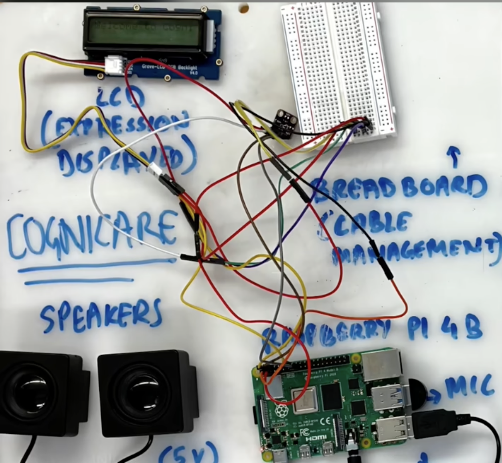
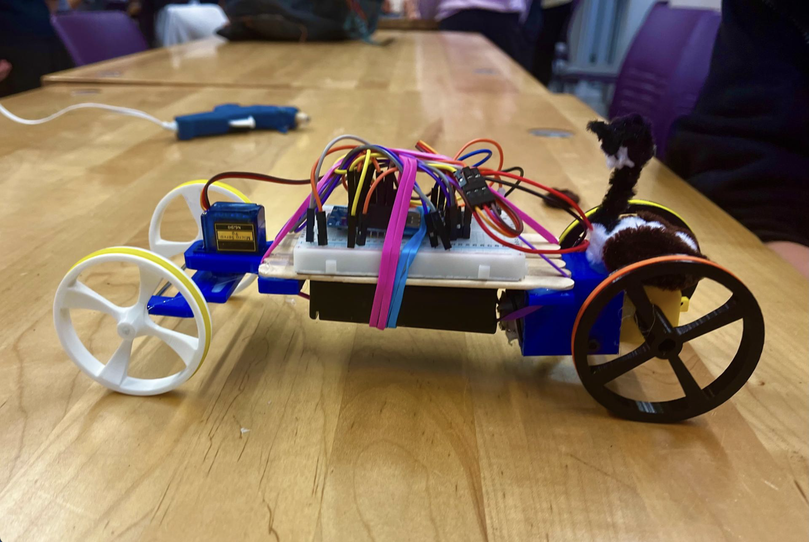
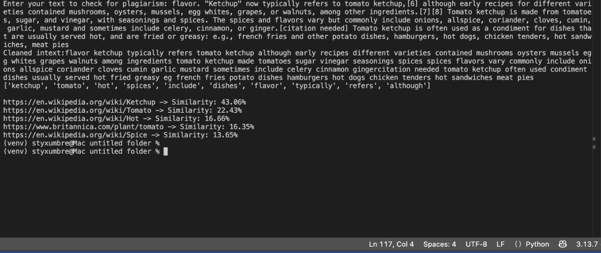

!!
[Part 1: Your Regex Is Not a Parser](/works/custom-clang-tidy-checks1)

How to write a custom clang-tidy check very fast. A better way to de bug.
May 2026

[On Defaults](/works/on-defaults)

This is inherited.
Apr 2026

[Cognicare](/works/cognicare)

Conversation companion. On a Pi.
Nov 2025

[RC Car](/works/rc-car)

Built in one hour. Goose mascot: RC Carl.
Sept 2025

[Plagiarism Detector](/works/plag-detector)

A plagiarism detector with privacy.
Sept 2025
